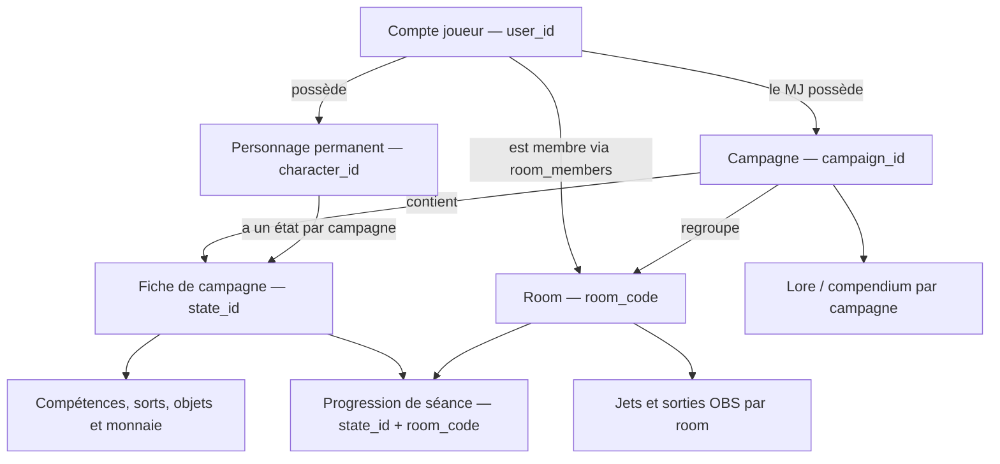
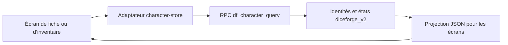

# Dice Forge — Modèle de données et identifiants

**Document de référence de l’existant — 7 octobre 2026**  
**Public :** chef de projet, MJ et intervenants souhaitant comprendre le fonctionnement du projet.  
**Version du code examinée :** `6a464588e1af8b411eb260e9fac654fb451cbaac` (`main`).  
**État décrit :** production après la livraison des campagnes identifiées et la reprise Valombre.

Ce document décrit les structures, identifiants, relations et flux déjà présents. Il ne contient aucune proposition de modification. Les constats reposent sur le code du dépôt, les migrations successives et une consultation en lecture seule des métadonnées de la base Supabase de production. Les comptes et contenus privés des joueurs ne sont pas reproduits.

## 1. Vue d’ensemble

Dice Forge comporte une application web et un compagnon local pour le MJ. L’application web utilise Supabase pour les comptes, les campagnes, les rooms, les personnages et les échanges en temps réel. Le compagnon local fournit notamment le cockpit, le tracker de combat et la Battle Map.

Le modèle en ligne distingue cinq notions :

| Notion | Ce qu’elle représente | Identifiant utilisé aujourd’hui |
| --- | --- | --- |
| Joueur / compte | La personne authentifiée, qui peut posséder plusieurs personnages | UUID Supabase Auth, appelé `user_id` |
| Campagne | Un cadre de jeu commun, regroupant plusieurs rooms et leurs données de campagne | UUID `campaign_id` |
| Room / salon | Un espace de connexion, de jets et de séance | Code court `room_code`, par exemple `4SSU` |
| Personnage | Une identité permanente, avec un propriétaire et un statut | UUID `character_id` |
| Fiche de personnage / état de campagne | Les données de ce personnage dans une campagne : caractéristiques, compétences, sorts, progression et inventaire | UUID `state_id` |

**La distinction essentielle est celle entre personnage et fiche.** Un personnage possède une identité permanente. Sa fiche appartient à une campagne. Plusieurs rooms de cette campagne accèdent à la même fiche ; elles ne créent pas chacune une copie du personnage ou de son inventaire.

Un même personnage peut aussi avoir un état distinct dans une autre campagne, à la suite d’un rattachement explicite. Ces états possèdent des `state_id` différents. Leur progression et leur inventaire sont séparés, tandis que l’identité et le statut du personnage restent communs.

### Vocabulaire technique employé

- **UUID** : identifiant long généré automatiquement, tel que `96ad32a9-c444-5c93-8559-7d2757534b2c`. Il sert à distinguer une entité indépendamment de son nom.
- **Table** : ensemble de lignes représentant un type de données.
- **Clé primaire** : valeur, ou combinaison de valeurs, unique dans une table.
- **Référence / clé étrangère** : lien vérifié par la base entre deux tables.
- **Schéma** : espace qui regroupe des tables et fonctions dans la base. Le nom complet `diceforge_v2.states` signifie « table `states` du schéma `diceforge_v2` ».
- **RPC** : fonction exécutée dans la base à la demande du navigateur. Elle applique les règles et réalise les opérations autorisées.
- **JSON / JSONB** : données structurées regroupées dans un champ, par exemple les champs libres d’une fiche ou les propriétés d’un objet.

## 2. Fonctionnement des identifiants

### 2.1. Joueurs et comptes

L’identifiant stable du joueur est `auth.users.id`, attribué par Supabase Auth. C’est un UUID. Le navigateur le reçoit lors de la connexion et le transmet sous les noms `userId` dans son contexte local et `user_id` dans les requêtes.

Cet identifiant relie notamment :

- le compte aux rooms dont il est membre ;
- le compte aux personnages qu’il possède ;
- le compte aux campagnes et rooms dont il est propriétaire ;
- le compte à ses sélections de personnages, ses jets et certaines actions historisées.

Le nom de joueur (`player_name`) sert à l’affichage. Il est conservé dans les métadonnées Auth et dans plusieurs lignes de données. Dans le parcours de connexion actuel, le nom saisi est normalisé en pseudo-adresse de connexion de la forme `<nom-normalisé>@diceforge.app`. La relation avec les données actuelles repose néanmoins sur l’UUID du compte.

Il n’existe pas de table métier unique appelée « joueurs » qui serait la référence de toutes les données. Le compte provient d’Auth ; `room_members` enregistre ses appartenances aux salons ; `diceforge_v2.mj_users` enregistre les comptes bénéficiant du rôle MJ explicite.

Le libellé « MJ » et la possession d’une room ne suffisent pas à eux seuls à attribuer le rôle administratif MJ. La gestion d’une campagne exige ce rôle et la propriété de la campagne concernée.

### 2.2. Campagnes

Une campagne est une ligne de `diceforge_v2.campaigns`. Son identifiant est `id`, exposé dans les relations sous le nom `campaign_id`.

À la création d’une nouvelle campagne par le MJ, la base génère automatiquement cet UUID avec `gen_random_uuid()`. Le navigateur n’a pas à le fournir. Les données principales sont :

| Champ | Signification |
| --- | --- |
| `id` | Identité unique de la campagne |
| `name` | Nom affiché |
| `description` | Description de la campagne |
| `owner_user_id` | Compte propriétaire |
| `reference_room` | Code de la room de référence, si elle existe |
| `created_at` | Date de création |
| `archived_at` | Date d’archivage, ou valeur vide pour une campagne non archivée |

Le nom n’est pas soumis à une contrainte d’unicité. Deux campagnes peuvent donc porter le même nom tout en ayant des UUID différents. Les menus utilisent l’UUID pour sélectionner ou modifier une campagne.

Une campagne peut exister sans room au moment de sa création. Sa première room devient automatiquement sa référence si `reference_room` est encore vide. Cette référence est un lien vers une room ; elle ne remplace pas l’UUID de campagne.

### 2.3. Rooms

Une room est une ligne de `public.rooms`. **Son code est son identifiant** : `room_code` est la clé primaire. Le modèle actuel ne lui ajoute pas un UUID de room.

Le navigateur propose un code aléatoire de quatre caractères, à partir de l’alphabet `ABCDEFGHJKLMNPQRSTUVWXYZ23456789`. La base vérifie son unicité lors de l’insertion. Le code sert dans les URL (`?room=4SSU`), les connexions, les jets et les filtres des overlays OBS.

Chaque room comporte :

- `room_code` : son identité ;
- `campaign_id` : sa campagne, obligatoire ;
- `owner_id` : le compte propriétaire ;
- `owner_name` : son nom affiché ;
- `created_at` : sa date de création.

Le rattachement à la campagne est immuable dans les opérations actuelles : une room ne peut pas être déplacée vers une autre campagne. La base maintient aussi une liaison dans `diceforge_v2.campaign_rooms`, utilisée par des fonctions existantes. Les contraintes et triggers imposent que cette liaison corresponde à `rooms.campaign_id`.

L’appartenance d’un joueur à une room est identifiée par la paire **`(room_code, user_id)`**, dans `public.room_members`. Il n’existe pas d’identifiant supplémentaire pour cette appartenance. Un joueur peut appartenir à plusieurs rooms, et une room peut accueillir plusieurs joueurs.

### 2.4. Personnages et fiches

#### Identité permanente : `character_id`

`diceforge_v2.characters.id` identifie le personnage permanent. Il est exposé à l’application sous le nom `character_id`. La table conserve notamment le propriétaire (`owner_user_id`), le nom, le nom de joueur d’origine, le statut et les données de génération.

Un compte peut posséder plusieurs personnages, y compris des personnages de même nom. Le nom du personnage ne constitue donc pas sa clé d’identité.

Les nouveaux personnages reçoivent un UUID généré dans la base. Les personnages repris lors de la migration initiale ont reçu des UUID déterministes, calculés à partir des anciennes sources par `prepare.py`. Ces UUID ont été conservés lors de la reprise Valombre.

**La table `characters` ne comporte pas de `campaign_id` unique.** Le rattachement du personnage aux campagnes passe par ses états dans `states`. Certaines identités historiques archivées peuvent ne pas avoir d’état de campagne.

#### Fiche dans une campagne : `state_id`

`diceforge_v2.states.id` identifie la fiche, également appelée « état de campagne ». Chaque état référence obligatoirement :

- une campagne par `campaign_id` ;
- un personnage par `character_id`.

La paire **`(campaign_id, character_id)` est unique**. Il ne peut donc y avoir qu’un état pour le même personnage dans la même campagne.

L’état possède son propre UUID, exposé sous le nom `state_id`. Dans les réponses compatibles avec les anciens écrans, le champ `id` d’une fiche ou d’un inventaire v2 correspond également à cet UUID d’état.

| Données d’une fiche | Structure actuelle |
| --- | --- |
| Champs libres et informations descriptives | `states.fields`, au format JSONB |
| Caractéristiques numériques | `states.stats`, au format JSONB |
| Compétences | Lignes de `diceforge_v2.skills` liées par `state_id` |
| Sorts | Lignes de `diceforge_v2.spells` liées par `state_id` |
| Objets d’inventaire | Lignes de `diceforge_v2.items` liées par `state_id` |
| Monnaie | Ligne de `diceforge_v2.wallets`, identifiée par `state_id` |
| Validation de création et origine des points | Tables complémentaires liées à l’état |
| Progression pendant une séance | État + room dans `xp_sessions` et les historiques associés |

**L’inventaire actuel appartient à l’état de campagne.** Il ne possède pas un identifiant global indépendant de la fiche. Chaque objet peut, en revanche, avoir son propre UUID.

Les compteurs `revision`, `sheet_revision` et `inventory_revision` indiquent des versions de données. Ils servent à refuser une sauvegarde fondée sur une version périmée ; ce ne sont pas des identifiants d’entité.

### 2.5. Autres identifiants rencontrés

| Valeur | Ce qu’elle identifie | Ce qu’elle ne désigne pas |
| --- | --- | --- |
| `skill_id`, par exemple `skill.estimation` | Une compétence du catalogue de règles | Un personnage ou une fiche |
| `spell_id` | Un sort du catalogue de règles | Un personnage ou une campagne |
| `skills.id`, `spells.id` | Une ligne de compétence ou de sort pour un état | L’élément du catalogue lui-même |
| `items.id` | Un objet d’inventaire dans un état | L’inventaire complet |
| `request_id` / `p_request` | Une demande d’opération, pour éviter de l’exécuter deux fois lors d’une répétition | Un compte, une campagne ou un personnage |
| `legacy_index` | Une position d’origine dans un ancien tableau | Une identité métier stable |
| `source_sheet_id`, `source_inventory_id` | Un ancien ID numérique conservé comme provenance | Le `state_id` actuel |

## 3. Liens entre les entités

### Schéma de lecture

Les flèches montrent les relations fonctionnelles. Le tableau suivant précise où les références sont effectivement stockées.

| Structure qui référence | Référence stockée | Structure visée | Relation |
| --- | --- | --- | --- |
| `campaigns` | `owner_user_id` | `auth.users.id` | Un compte peut posséder plusieurs campagnes |
| `campaigns` | `reference_room` | `rooms.room_code` | Une campagne possède au plus une room de référence |
| `rooms` | `campaign_id` | `campaigns.id` | Une room appartient à exactement une campagne ; une campagne peut avoir plusieurs rooms |
| `rooms` | `owner_id` | `auth.users.id` | Un compte peut posséder plusieurs rooms |
| `room_members` | `room_code` et `user_id` | `rooms` et `auth.users` | Relation entre plusieurs comptes et plusieurs rooms |
| `campaign_rooms` | `room_code` et `campaign_id` | `rooms` et `campaigns` | Liaison conservée, cohérente avec la campagne obligatoire de la room |
| `characters` | `owner_user_id` | `auth.users.id` | Un compte peut posséder plusieurs personnages |
| `states` | `campaign_id` et `character_id` | `campaigns` et `characters` | Une fiche unique pour chaque paire campagne/personnage |
| `skills`, `spells`, `items`, `wallets` | `state_id` | `states.id` | Contenu de la fiche et de l’inventaire |
| `character_roster` | `campaign_id`, `character_id`, éventuellement `reserved_user_id` | Campagne, personnage et compte | Disponibilité et réservation du personnage dans une campagne |
| `character_selections` | `campaign_id`, `user_id`, éventuellement `character_id` | Campagne, compte et personnage | Au plus une sélection enregistrée par compte et campagne |
| `xp_sessions` | `state_id` et `room_code` | Fiche et room | Une entrée de progression par fiche et room |
| `rolls` | `room_code`, éventuellement `user_id` | Code de room et compte | Historique de jets par room ; le lien au compte est une clé étrangère |
| `compendium.fiches` | `campaign_id` | `campaigns.id` | Contenu de lore propre à une campagne |
| `compendium.annotations` | `campaign_id`, `fiche_id`, `author_id` | Fiche de lore et compte | Annotation de la fiche de lore dans la même campagne |

Les propriétaires peuvent être vides dans certaines structures héritées. Les parcours de création actuels renseignent le compte connecté et vérifient ses droits. Le `room_code` de `rolls` est utilisé comme lien fonctionnel ; la table ne comporte pas actuellement de clé étrangère vers `rooms` pour ce champ.

### Exemple avec Valombre

Au 7 octobre 2026, l’état de production vérifié est le suivant :

- **Nom :** Valombre.
- **ID :** `96ad32a9-c444-5c93-8559-7d2757534b2c`.
- **Room de référence :** `4SSU`.
- **Rooms rattachées :** `4SSU`, `5XHZ`, `8QXJ`, `FW5A`, `KP5Z`, `S3R4`, `SK6V`, `TC6M`.
- **Lore :** 140 fiches de compendium rattachées à cet ID à la date du constat.

Si un personnage possède une fiche dans Valombre, consulter cette fiche depuis deux de ces rooms renvoie le même `character_id` et le même `state_id`. Le code de room détermine cependant le contexte des jets et de la progression de séance.

`4SSU` reste la référence de reprise des données. Cela ne signifie pas que la session XP de chaque personnage y est encore ouverte. La fiche est commune à la campagne, mais une session clôturée conserve ses règles de consultation et de sauvegarde.

Lors de la reprise, une seconde version historique d’un même personnage n’a pas été fusionnée avec sa fiche Valombre. Elle reste conservée dans une campagne archivée, sans room active. Les identifiants et contenus historiques n’ont pas été supprimés pour contourner l’unicité campagne/personnage.

## 4. Architecture actuelle du projet

### 4.1. Application web et services en ligne

L’application est composée de fichiers HTML, CSS et de modules JavaScript natifs. Elle n’a pas d’étape de compilation npm. GitHub Pages sert les fichiers statiques de la branche `main`. Le navigateur exécute l’interface, les calculs d’affichage et les animations, puis communique directement avec Supabase.

| Ensemble | Rôle actuel |
| --- | --- |
| `index.html` et `js/app.js` | Lanceur de dés, génération de personnages et joute verbale |
| `js/supabase-room.js` | Connexion aux rooms, contexte de campagne, gestion MJ des campagnes, jets et temps réel |
| `pj.html` et `js/pj-sheet.js` | Édition de la fiche, compétences, sorts, validation et progression |
| `inventory-sheet.html` et modules d’inventaire | Inventaire, monnaie, synchronisation et opérations locales en attente |
| `suivi-mj.html`, `js/suivi-mj.js`, `js/mj-room-data.js` | Vue du groupe, chargement des fiches et carnet MJ local |
| `login.html`, `account.html` et modules Auth | Connexion et contexte de compte |
| `obs.html`, `obs-dice.html`, `obs-verbal.html` | Sorties pour les sources navigateur OBS |
| Pages d’aides, livrets et impression | Consultation des règles et présentation des fiches |

Supabase fournit trois services principaux : **Auth** pour les comptes, **PostgreSQL** pour les données persistantes et **Realtime** pour diffuser les changements aux navigateurs et overlays.

La configuration distingue une production et une base de recette. La production est utilisée par défaut, y compris en local. Sur une adresse locale reconnue, `?environment=test` permet de sélectionner la recette pour l’onglet, via `sessionStorage`. Les identifiants et données de ces deux bases constituent des ensembles séparés. Ce document décrit le schéma de production vérifié ; il ne certifie pas que la recette possède exactement le même état de migration.

### 4.2. Organisation de la base

| Espace de données | Contenu et rôle |
| --- | --- |
| `auth` | Comptes et authentification gérés par Supabase |
| `public` | Rooms, appartenances, jets, états OBS, anciennes tables de personnages et fonctions d’entrée de l’application |
| `diceforge_v2` | Campagnes, identités permanentes, états de campagne, inventaires, catalogues, création, progression et historiques |
| `compendium` | Fiches de lore et annotations, vérifiées dans la base déployée |
| Schémas privés de sauvegarde | Copies et métadonnées conservées pour les livraisons ; ils ne servent pas aux lectures courantes du site |

Le modèle combine des tables relationnelles pour les identités et leurs liens, et des champs JSONB pour les informations souples. Les compétences, sorts, objets et monnaies possèdent des structures dédiées. Le serveur reconstruit une représentation JSON compatible avec les formulaires existants.

Les tables privées de `diceforge_v2` ne sont pas directement exposées aux écritures du navigateur. Les fonctions publiques vérifient le compte, la campagne, la cible et les droits, puis appliquent les opérations. Les accès directs aux tables publiques sont également encadrés par les politiques de sécurité de la base.

### 4.3. Couche de compatibilité des personnages

Le navigateur utilise encore des appels nommés `.from('personnages')`, `.from('pj_sheets')` et `.from('pj_inventory')`. Avec `characterV2` activé, `js/supabase-client.js` et `js/character-store.js` interceptent ces appels et les convertissent en appels à `public.df_character_query`.

Le nom de table vu dans un écran ne suffit donc pas à identifier son stockage réel. Aujourd’hui, les données courantes sont lues et écrites dans le modèle v2 derrière cette fonction.

Le serveur déduit la campagne de la room transmise. Il refuse les écritures qui ciblent une autre campagne ou un personnage existant qui n’y possède pas d’état. Le rattachement d’un personnage existant est une opération explicite, distincte d’une sauvegarde ordinaire.

Le code conserve un chemin de compatibilité vers les anciennes tables lorsque le serveur retourne `legacy: true`. La configuration v2 est activée dans la production examinée. Ce chemin historique explique la présence de requêtes et de noms d’anciennes ressources dans le JavaScript.

### 4.4. Anciennes structures encore conservées

| Table historique | Identifiant historique | Contenu et liens encore présents |
| --- | --- | --- |
| `public.personnages` | `player_name`, clé primaire textuelle | Résultat historique de génération ; `user_id` et `campaign_id` |
| `public.pj_sheets` | `id`, entier `bigint` | JSON de fiche, contenu Markdown, `room_code`, nom de joueur, `user_id`, `campaign_id` |
| `public.pj_inventory` | `id`, entier `bigint` | JSON d’inventaire, `room_code`, nom de joueur, `user_id`, `campaign_id` |

Les deux dernières tables comportent aussi une unicité historique sur `(room_code, player_name)`. Ces règles expliquent d’anciens appels d’enregistrement et ne décrivent pas l’identité des fiches v2.

Les trois tables ont reçu un `campaign_id` obligatoire lors de la reprise Valombre. Elles sont conservées comme sources historiques et pour la compatibilité. Les nouvelles écritures v2 ne sont pas une mise à jour systématique de ces anciennes copies.

Le modèle v2 conserve aussi la provenance dans les champs `source_*`, les données `legacy_*` et `diceforge_v2.archives`. Pour le carnet MJ, `df_mj_notebook_sources` fournit les correspondances entre anciens IDs de fiches et identifiants actuels, afin de retrouver les notes locales liées aux anciennes sources.

Les SQL du dépôt décrivent des étapes successives. En particulier, `schema.sql` et `api.sql` sont des bases initiales : leurs définitions sont complétées ou remplacées par les migrations ultérieures. Leurs anciennes contraintes ne constituent pas, à elles seules, le schéma actuel.

### 4.5. Lore / compendium

Les fiches de lore sont distinctes des fiches de personnages. Dans la base déployée, une fiche de lore est identifiée par la paire **`(campaign_id, id)`** dans `compendium.fiches`, où `id` est un UUID.

Une annotation possède son propre UUID et référence la paire `(campaign_id, fiche_id)`, ainsi que son auteur Auth. La clé étrangère impose que l’annotation appartienne à la même campagne que sa fiche de lore.

La fonction `cm_context(p_room)` retrouve la campagne via `campaign_rooms` et renvoie notamment `campaignId`, `campaignName` et le contexte MJ. Les fonctions `cm_*` assurent les lectures, enregistrements, imports, suppressions et restaurations. Ce constat provient du schéma et des fonctions déployés ; le dépôt examiné ne contient pas les sources complètes de ce module.

### 4.6. Compagnon local MJ

`DiceForge.bat` lance le compagnon Python situé dans `Roll20/Webtracker`. Flask et Flask-SocketIO servent le cockpit, le tracker, la Battle Map et les vues associées sur `http://127.0.0.1:5000/`. Les fichiers de l’application web sont également accessibles sous `/dice/`.

Le cockpit mémorise le code de room dans `diceforge_cockpit_room` et l’ajoute aux liens Dice Forge et OBS. Les comptes, campagnes et fiches en ligne continuent à passer par Supabase.

**Le combat et la Battle Map utilisent un modèle local distinct.** L’état de combat contient notamment les participants, le round, la phase et le participant actif. Il est diffusé par Socket.IO et sauvegardé dans des fichiers JSON locaux. La carte et ses tokens sont eux aussi enregistrés localement.

Ces structures ne portent pas de `campaign_id`, `user_id` ou `character_id` Supabase. Le code de room du cockpit ne partitionne pas le combat ou la carte par campagne. Les identifiants de tokens locaux, dont certains sont dérivés du rôle et du nom, ne sont pas les UUID des personnages en ligne.

L’import Obsidian lit des notes Markdown du coffre configuré et en extrait les informations utiles au tracker. Le chemin de la note identifie la source. Le champ `id` de son frontmatter peut servir à retrouver un portrait ; il n’est pas transmis comme lien d’identité Supabase au participant du tracker.

Enfin, `scripts/serve_local.py` sert l’application web et le relais verbal sur `http://127.0.0.1:8765/`. Il ne fournit pas les outils du compagnon Flask.

## 5. Flux de données principaux

### 5.1. Connexion et entrée dans une room

1. Le joueur s’authentifie auprès de Supabase Auth ; le navigateur reçoit l’UUID du compte.
2. Le navigateur vérifie le code dans `public.rooms`.
3. Il crée ou actualise l’appartenance `(room_code, user_id)` dans `room_members`.
4. Il charge l’identité de campagne par `df_campaigns`, opération `room`.
5. Il charge le personnage sélectionné et sa fiche dans cette campagne, selon les droits du compte.

Le navigateur mémorise le contexte pour faciliter la navigation. Lors de sa restauration, il revalide le compte, la room, l’appartenance, le propriétaire et la campagne auprès du serveur.

### 5.2. Création d’une campagne et d’une room

1. Le MJ crée la campagne par `df_campaigns`, avec son nom et sa description.
2. La base crée la campagne et renvoie son UUID.
3. À la création d’une room, le MJ sélectionne obligatoirement la campagne.
4. `df_create_session_room` vérifie les droits puis crée la room, sa liaison de campagne et l’appartenance du MJ dans la même transaction.
5. Si la campagne n’a pas encore de référence, cette première room devient sa `reference_room`.

Une ancienne signature de la fonction reste disponible pour les clients de transition : elle exige une room source existante et en déduit la campagne. Elle ne crée plus implicitement une campagne sans nom.

### 5.3. Création et sélection d’un personnage

1. L’action « Nouveau personnage » ouvre une nouvelle création sans effacer les personnages déjà présents.
2. `df_generate_character` génère les caractéristiques côté serveur et crée l’identité permanente ainsi que l’état dans la campagne de la room.
3. La base renvoie `character_id`, `state_id` et `campaign_id` et enregistre la sélection du compte.
4. La fiche est sauvegardée comme brouillon ; la validation explicite passe par `df_validate_creation`.

La sélection serveur est identifiée par `(campaign_id, user_id)`. Disponibilité, propriété et sélection sont des notions distinctes. Les prétirés utilisent une attribution contrôlée ; choisir un personnage ordinaire ne transfère pas la propriété de la fiche d’un autre joueur.

La reprise d’un personnage dans une autre campagne utilise l’opération explicite `attach` du roster. Elle crée un nouvel état de campagne à partir des données de génération conservées, sans reprendre implicitement la progression ou l’inventaire d’une autre campagne.

### 5.4. Lecture et sauvegarde d’une fiche ou d’un inventaire

1. L’écran transmet la room et les critères de cible à l’adaptateur de données.
2. L’adaptateur conserve le `character_id` de la fiche ouverte et transmet la révision attendue.
3. La RPC déduit la campagne de la room, contrôle la cible et les autorisations.
4. La lecture reconstruit le JSON des formulaires depuis l’état et ses tables de contenu.
5. La sauvegarde autorisée met à jour les données et leurs révisions.

La fiche et l’inventaire possèdent des compteurs de révision distincts. Une écriture concurrente sur la même ressource peut être refusée si sa version de départ est périmée. L’inventaire possède également une file locale d’opérations : il relit les données distantes, réapplique les opérations en attente et conserve les modifications locales en cas de conflit.

### 5.5. Séances, progression et cycle de vie

Les compétences, sorts et inventaires appartiennent à la campagne. Les données de progression d’une séance appartiennent à la paire `(state_id, room_code)` dans `xp_sessions`. Les tentatives sont enregistrées dans `xp_attempts` ; les événements de points conservent l’origine des gains. Une seule session de progression peut être ouverte à la fois pour un état.

Le modèle conserve aussi la validation de création, les allocations initiales et les événements de cycle de vie. Le personnage permanent porte un statut parmi `active`, `archived`, `dead` et `deleted`.

Le décès concerne l’identité permanente, y compris ses autres campagnes : les états et historiques sont conservés, mais les opérations de jeu sont bloquées. La suppression métier place le personnage dans une corbeille et conserve ses états ; la restauration est une opération MJ contrôlée. Ces actions ne correspondent pas à une suppression physique ordinaire de toutes les données.

### 5.6. Jets et diffusion OBS

Les jets ordinaires sont enregistrés dans `public.rolls` avec le code de room, le compte lorsqu’il est identifié, le nom affiché, l’expression et le résultat. Ils restent liés à la room ; leur campagne se retrouve par cette room. Ils ne portent pas de lien obligatoire à un `character_id` ou à un `state_id`.

`public.obs_rolls` est un flux public dérivé, identifié par `roll_id` et filtré par room dans les overlays. Les changements sont diffusés via Supabase Realtime. Un jet caché produit une indication masquée sans exposer l’expression, les dés ou le résultat dans ce flux public.

La joute verbale publie son état par room via `df_publish_verbal_overlay`, dans `obs_verbal_states`. Les overlays le relisent. En local, un relais en mémoire peut également transporter cet état par room. Ce flux est distinct des fiches et des états de campagne des personnages.

## 6. Données mémorisées dans le navigateur

Le stockage local facilite la navigation, les brouillons et certaines reprises. Il ne constitue pas la référence des identités et droits conservés dans Supabase.

Ce stockage est propre au navigateur et à l’origine du site : protocole, hôte et port. Les brouillons, caches et carnets de GitHub Pages et des serveurs locaux sont donc conservés séparément, même dans le même navigateur.

| Clé locale | Rôle | Portée |
| --- | --- | --- |
| `diceforge_room` | Room et compte courants, noms affichés, contexte de campagne et indicateur de propriétaire | Navigateur ; contexte revalidé auprès du serveur |
| `diceforge_character:<userId>:<roomCode>` | Identité sélectionnée localement, ou marqueur `new` | Compte et room ; la sélection serveur reste par campagne |
| `dice-forge.pj-markdown.v2:<userId>:<roomCode>[:<characterId>]` | Brouillon de fiche | Compte, room et personnage lorsque précisé |
| `dice-forge.inventory.v1:<userId>:<roomCode>[:<characterId>]` | Cache d’inventaire | Compte, room et personnage lorsque précisé |
| Suffixe `:history` de la clé d’inventaire | Journal local d’opérations d’inventaire | Même portée que son inventaire |
| `dice-forge.mj-notebook.v1.<roomCode>` | Notes et surcharges du carnet MJ | Room et navigateur |
| `diceforge_cockpit_room` | Room choisie dans le cockpit | Navigateur local |

Les caches de fiche et d’inventaire sont donc séparés par room, même lorsque les données distantes proviennent d’un même état de campagne partagé.

Le carnet MJ conserve ses notes localement. Son champ interne `campaign` représente le titre du carnet local, et non le `campaign_id` serveur. Les notes de deux carnets de room ne deviennent pas automatiquement un carnet commun du seul fait que leurs rooms appartiennent à la même campagne.

## 7. Repères pour lire le code et les données actuels

- `user_id` identifie un compte ; `player_name` est principalement un libellé, malgré son rôle de clé dans l’ancienne table `personnages`.
- `campaign_id` identifie une campagne ; ni son nom ni sa room de référence ne remplacent cet UUID.
- `room_code` est l’identité actuelle d’une room et la porte d’entrée du contexte de campagne.
- `character_id` identifie un personnage permanent ; `state_id` identifie sa fiche dans une campagne.
- Un `id` numérique dans une source historique et un `id` UUID dans une réponse v2 ne désignent pas le même système d’identification.
- Les données en ligne partagées par campagne, les journaux de séance par room, les caches du navigateur et les outils locaux du MJ ont des portées différentes.
- Les anciens fichiers SQL et les anciennes étapes des documents de migration constituent un historique ; les migrations ultérieures et l’état de production précisent le comportement actuel.

## 8. Sources de référence

### Code et migrations du dépôt

| Sujet | Sources principales |
| --- | --- |
| Organisation du projet et livraison | [README.md](README.md), [MISE_EN_PRODUCTION.md](MISE_EN_PRODUCTION.md), [BASE_TEST.md](BASE_TEST.md) |
| Connexion et identité du compte | [auth-common.js](js/auth-common.js), [login.js](js/login.js), [auth-guard.js](js/auth-guard.js), [supabase-auth.sql](supabase-auth.sql) |
| Rooms et campagnes dans l’interface | [supabase-room.js](js/supabase-room.js), [supabase-config.js](supabase-config.js) |
| Campagne obligatoire et règles actuelles | [campaign-management.sql](migrations/character-v2/campaign-management.sql) |
| Reprise Valombre et conservation des identifiants | [campaign-valombre.sql](migrations/character-v2/campaign-valombre.sql), [prepare.py](migrations/character-v2/prepare.py) |
| Socle du modèle v2 et représentation compatible | [schema.sql](migrations/character-v2/schema.sql), [api.sql](migrations/character-v2/api.sql), [save-fixes.sql](migrations/character-v2/save-fixes.sql), [README des migrations](migrations/character-v2/README.md) |
| Adaptateur du navigateur | [supabase-client.js](js/supabase-client.js), [character-store.js](js/character-store.js) |
| Génération et gestion des personnages | [character-generation.sql](migrations/character-v2/character-generation.sql), [character-roster.sql](migrations/character-v2/character-roster.sql), [character-deletion.sql](migrations/character-v2/character-deletion.sql), [character-roster.js](js/character-roster.js) |
| Création et progression | [creation-lock.sql](migrations/character-v2/creation-lock.sql), [progression.sql](migrations/character-v2/progression.sql), [spell-learning.sql](migrations/character-v2/spell-learning.sql) |
| Fiches, inventaires et catalogue | [pj-sheet.js](js/pj-sheet.js), [inventory-sheet.js](js/inventory-sheet.js), [inventory-sync.js](js/inventory-sync.js), [character-ids.js](js/character-ids.js), [catalog.json](migrations/character-v2/catalog.json) |
| Anciennes tables conservées | [supabase-personnages.sql](supabase-personnages.sql), [supabase-pj-sheets.sql](supabase-pj-sheets.sql), [supabase-inventory.sql](supabase-inventory.sql) |
| Carnet et correspondances historiques | [suivi-mj.js](js/suivi-mj.js), [mj-room-data.js](js/mj-room-data.js) |
| Flux OBS et joute verbale | [supabase-obs-hidden-placeholders.sql](supabase-obs-hidden-placeholders.sql), [supabase-verbal-overlay.sql](supabase-verbal-overlay.sql), [verbal-overlay-client.js](js/verbal-overlay-client.js) |
| Compagnon, combat et import local | [run.py](Roll20/Webtracker/run.py), [routes.py](Roll20/Webtracker/app/routes.py), [models.py](Roll20/Webtracker/app/models.py), [markdown_importer.py](Roll20/Webtracker/app/markdown_importer.py) |
| Battle Map et identifiants locaux | [battlemap.py](Roll20/Webtracker/app/battlemap.py), [webtracker-connector.js](Roll20/Webtracker/app/static/js/webtracker-connector.js) |
| Serveur de prévisualisation | [serve_local.py](scripts/serve_local.py) |

### Vérification de la base déployée

Le 7 octobre 2026, une consultation en lecture seule de la production Supabase (`bwrylcvkplonkfhnegvm`) a vérifié les types de colonnes, valeurs par défaut, clés primaires, unicités et clés étrangères des structures principales. Elle a confirmé l’activation v2, l’identité de Valombre, ses huit rooms et le rattachement du compendium. Les relations du compendium et la fonction `cm_context` ont été vérifiées dans la base, car leurs sources complètes ne figurent pas dans ce dépôt.

Ce document est un constat daté. Les quantités de rooms ou de contenus décrites dans l’exemple Valombre correspondent à cette date.
