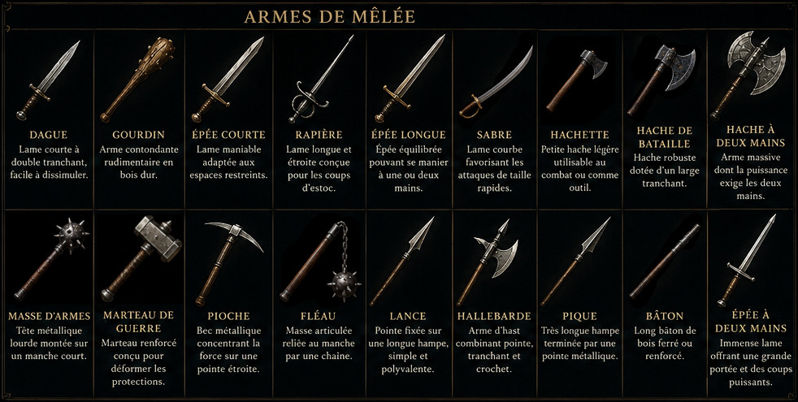
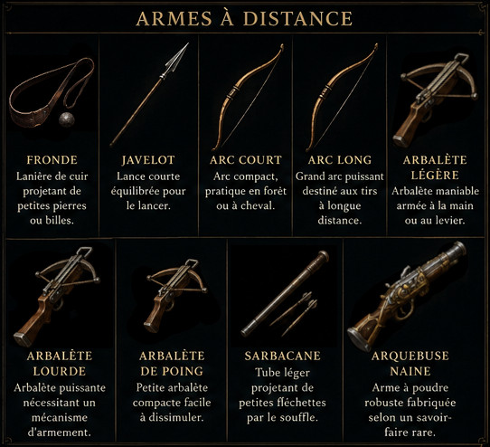
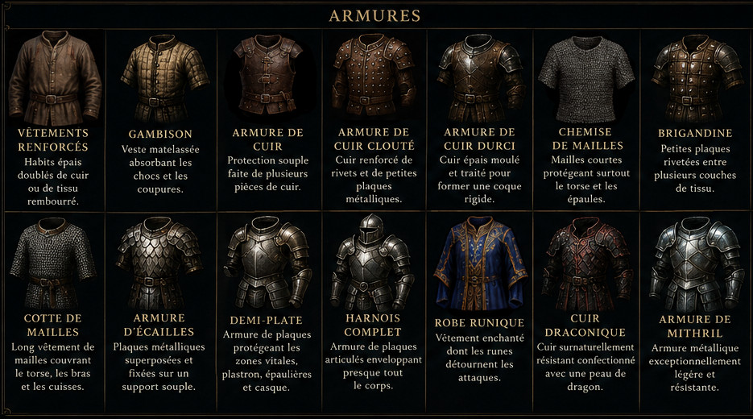
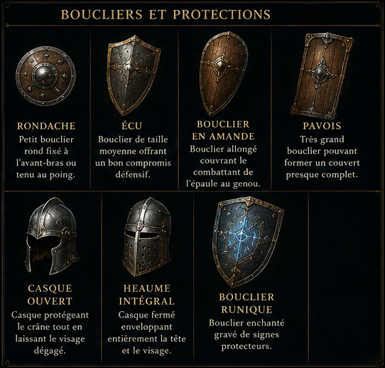

# Inventaire médiéval-fantastique

Catalogue générique d'armes, d'armures et de protections, adaptable à différents systèmes de jeu de rôle.

> **Monnaie :** 10 pièces d'argent (pa) = 1 pièce d'or (po).  
> Les armures fournissent des points d'armure (PA) qui réduisent les dégâts. Les boucliers accordent un bonus en pourcentage au jet de Défense.

## Revenus mensuels

| Statut social | Revenu mensuel estimé |
|---|---:|
| Mendiant, malade, sans emploi fixe | 0 à 5 pa |
| Misérable / travail très irrégulier | 5 à 12 pa |
| Journalier pauvre | 1 à 2 po |
| Homme du peuple stable | 2 à 4 po |
| Ouvrier qualifié / mineur / bon domestique | 4 à 7 po |
| Artisan installé / contremaître | 8 à 15 po |
| Marchand confortable / notable local | 20 po et plus |

> **Repère principal :** un homme du peuple stable touche en moyenne **3 po par mois**.

## Budget d'équipement par tranche de revenu

Le statut social détermine la valeur totale de l'équipement qu'un nouveau personnage peut choisir dans cet inventaire.

| Tranche de revenu | Budget d'équipement initial |
|---|---:|
| Mendiant, malade, sans emploi fixe | 5 pa |
| Misérable / travail très irrégulier | 2 po |
| Journalier pauvre | 5 po |
| Homme du peuple stable | 10 po |
| Ouvrier qualifié / mineur / bon domestique | 20 po |
| Artisan installé / contremaître | 40 po |
| Marchand confortable / notable local | 80 po |

## Budget d'équipement selon le niveau de Richesse

À la création, le niveau de **Richesse** du personnage détermine la valeur totale de l'équipement qu'il peut choisir dans cet inventaire.

| Richesse indiquée par la profession | Budget conseillé | Plage possible |
|---|---:|---:|
| Indigent à Pauvre | 5 po | 1 à 10 po |
| Pauvre | 10 po | 10 po |
| Pauvre à Moyen | 20 po | 10 à 30 po |
| Pauvre à Aisé | 40 po | 10 à 75 po |
| Moyen | 30 po | 30 po |
| Moyen à Riche | 90 po | 30 à 150 po |
| Aisé | 75 po | 75 po |
| Aisé à Riche | 110 po | 75 à 150 po |
| Variable | 30 po par défaut | 1 à 150 po, selon le MJ |

> **Règles de création :** ce budget représente les possessions accumulées avant le début de l'aventure, et non une somme remise au personnage. Il sert uniquement à acheter son équipement initial. La monnaie non dépensée est perdue, sauf si le MJ autorise d'en conserver jusqu'à **10 %**. Les vêtements ordinaires, les petits effets personnels et les outils indispensables à la profession sont gratuits. Tout objet rare, magique ou culturellement restreint reste soumis à l'accord du MJ, même si le personnage peut en payer le prix.

> **Utilisation :** prenez le budget conseillé pour une création rapide. Le MJ peut choisir un montant compris dans la plage possible selon l'histoire et le Statut du personnage.

### Exemples

- **Indigent (1 po) :** un gourdin et une fronde.
- **Pauvre (10 po) :** un gambison et une dague, ou des vêtements renforcés, une lance et une rondache.
- **Moyen (30 po) :** une armure de cuir, une épée courte et un écu.
- **Aisé (75 po) :** une chemise de mailles, une épée courte, un écu et un casque ouvert.
- **Riche (150 po) :** une armure d'écailles, une épée longue, un écu et jusqu'à 3 po d'autres effets.

## Armes de mêlée

> **Dégâts X / Y :** X à une main, Y à deux mains.

| Arme | Description | Catégorie | Dégâts | Mains | Particularités | Prix |
|---|---|---|---:|:---:|---|---:|
| Dague | Lame courte à double tranchant, facile à dissimuler. | Légère | 1d4 | 1 | Discrète, peut être lancée | 2 po |
| Gourdin | Arme contondante rudimentaire en bois dur. | Légère | 1d4 | 1 | Facile à improviser | 5 pa |
| Épée courte | Lame maniable adaptée aux espaces restreints. | Légère | 1d6 | 1 | Rapide, précise | 8 po |
| Rapière | Lame longue et étroite conçue pour les coups d'estoc. | Fine | 1d8 | 1 | Perforante, élégante | 20 po |
| Épée longue | Épée équilibrée pouvant se manier à une ou deux mains. | Martiale | 1d8 / 1d10 | 1 ou 2 | Polyvalente | 15 po |
| Sabre | Lame courbe favorisant les attaques de taille rapides. | Martiale | 1d8 | 1 | Rapide, bonus à cheval | 18 po |
| Hachette | Petite hache légère utilisable au combat ou comme outil. | Légère | 1d6 | 1 | Peut être lancée | 5 po |
| Hache de bataille | Hache robuste dotée d'un large tranchant. | Martiale | 1d8 / 1d10 | 1 ou 2 | Efficace contre les boucliers | 12 po |
| Hache à deux mains | Arme massive dont la puissance exige les deux mains. | Lourde | 1d12 | 2 | Dévastatrice, encombrante | 30 po |
| Masse d'armes | Tête métallique lourde montée sur un manche court. | Martiale | 1d8 | 1 | Efficace contre les armures | 12 po |
| Marteau de guerre | Marteau renforcé conçu pour déformer les protections. | Martiale | 1d8 / 1d10 | 1 ou 2 | Brise-armure | 18 po |
| Pioche | Bec métallique concentrant la force sur une pointe étroite. | Martiale | 1d8 / 1d10 | 1 ou 2 | Perforante, brise-armure | 25 po |
| Fléau | Masse articulée reliée au manche par une chaîne. | Martiale | 1d8 | 1 | Contourne partiellement les boucliers | 15 po |
| Lance | Pointe fixée sur une longue hampe, simple et polyvalente. | Simple | 1d6 / 1d8 | 1 ou 2 | Allonge, peut être lancée | 3 po |
| Hallebarde | Arme d'hast combinant pointe, tranchant et crochet. | Lourde | 1d10 | 2 | Allonge, crochet, anti-cavalerie | 20 po |
| Pique | Très longue hampe terminée par une pointe métallique. | Lourde | 1d10 | 2 | Très longue, anti-charge | 8 po |
| Bâton | Long bâton de bois ferré ou renforcé. | Simple | 1d6 / 1d8 | 1 ou 2 | Défensif, focaliseur possible | 1 po |
| Épée à deux mains | Immense lame offrant une grande portée et des coups puissants. | Lourde | 2d6 | 2 | Puissante, lente | 40 po |

## Armes à distance

| Arme | Description | Dégâts | Portée | Mains | Particularités | Prix |
|---|---|---:|---:|:---:|---|---:|
| Fronde | Lanière de cuir projetant de petites pierres ou billes. | 1d4 | 25 m | 1 | Munitions faciles à trouver | 5 pa |
| Javelot | Lance courte équilibrée pour le lancer. | 1d6 | 20 m | 1 | Utilisable au corps à corps | 1 po |
| Arc court | Arc compact, pratique en forêt ou à cheval. | 1d6 | 60 m | 2 | Rapide et léger | 15 po |
| Arc long | Grand arc puissant destiné aux tirs à longue distance. | 1d8 | 120 m | 2 | Grande portée, force requise | 40 po |
| Arbalète légère | Arbalète maniable armée à la main ou au levier. | 1d8 | 80 m | 2 | Perforante, rechargement lent | 30 po |
| Arbalète lourde | Arbalète puissante nécessitant un mécanisme d'armement. | 1d12 | 120 m | 2 | Très perforante, lourde | 60 po |
| Arbalète de poing | Petite arbalète compacte facile à dissimuler. | 1d6 | 30 m | 1 | Discrète, rare | 75 po |
| Sarbacane | Tube léger projetant de petites fléchettes par le souffle. | 1d2 | 15 m | 2 | Silencieuse, adaptée aux poisons | 5 po |
| Arquebuse naine | Arme à poudre robuste fabriquée selon un savoir-faire rare. | 2d8 | 70 m | 2 | Bruyante, rare, rechargement très lent | 200 po |

## Armures

| Armure | Description | Type | PA | Mobilité | Discrétion | Prix |
|---|---|---|---:|---|---|---:|
| Vêtements renforcés | Habits épais doublés de cuir ou de tissu rembourré. | Légère | 1 | Excellente | Normale | 2 po |
| Gambison | Veste matelassée absorbant les chocs et les coupures. | Légère | 2 | Excellente | Normale | 8 po |
| Armure de cuir | Protection souple faite de plusieurs pièces de cuir. | Légère | 2 | Très bonne | Bonne | 10 po |
| Armure de cuir clouté | Cuir renforcé de rivets et de petites plaques métalliques. | Légère | 3 | Bonne | Normale | 25 po |
| Armure de cuir durci | Cuir épais moulé et traité pour former une coque rigide. | Intermédiaire | 3 | Moyenne | Mauvaise | 12 po |
| Chemise de mailles | Mailles courtes protégeant surtout le torse et les épaules. | Intermédiaire | 4 | Bonne | Mauvaise | 50 po |
| Brigandine | Petites plaques rivetées entre plusieurs couches de tissu. | Intermédiaire | 5 | Moyenne | Mauvaise | 80 po |
| Cotte de mailles | Long vêtement de mailles couvrant le torse, les bras et les cuisses. | Lourde | 6 | Réduite | Très mauvaise | 100 po |
| Armure d'écailles | Plaques métalliques superposées et fixées sur un support souple. | Lourde | 6 | Réduite | Très mauvaise | 120 po |
| Demi-plate | Armure de plaques protégeant les zones vitales, plastron, épaulières et casque. | Lourde | 7 | Faible | Très mauvaise | 300 po |
| Harnois complet | Armure de plaques articulés enveloppant presque tout le corps. | Lourde | 8 | Faible | Impossible | 800 po |
| Robe runique | Vêtement enchanté dont les runes détournent les attaques. | Magique | 3 | Excellente | Normale | 500 po |
| Cuir draconique | Cuir surnaturellement résistant confectionné avec une peau de dragon. | Magique | 5 | Très bonne | Bonne | 1 500 po |
| Armure de mithril | Armure métallique exceptionnellement légère et résistante. | Magique | 7 | Bonne | Normale | 4 000 po |

## Boucliers et protections

| Équipement | Description | Bonus de Défense | Particularités | Prix |
|---|---|---:|---|---:|
| Rondache | Petit bouclier rond fixé à l'avant-bras ou tenu au poing. | +10 % | Légère, laisse la main presque libre | 5 po |
| Écu | Bouclier de taille moyenne offrant un bon compromis défensif. | +20 % | Protection équilibrée | 12 po |
| Bouclier en amande | Bouclier allongé couvrant le combattant de l'épaule au genou. | +20 % | Utilisable contre les projectiles visibles | 20 po |
| Pavois | Très grand bouclier pouvant former un couvert presque complet. | +30 % | Couverture importante, très encombrant | 40 po |
| Casque ouvert | Casque protégeant le crâne tout en laissant le visage dégagé. | +1 contre les coups critiques | Bonne visibilité | 5 po |
| Heaume intégral | Casque fermé enveloppant entièrement la tête et le visage. | +2 contre les coups critiques | Vision et audition réduites | 25 po |
| Bouclier runique | Bouclier enchanté gravé de signes protecteurs. | +20 % | Résistance magique limitée | 600 po |

## Bonus et particularités de l’équipement

> **Règle générale :** une armure soustrait ses PA aux dégâts reçus. Un bouclier ajoute son bonus au jet de Défense lorsque le blocage décrit est possible ; il n'ajoute pas de PA.

- **Armure 1 à 8 PA :** soustrayez cette valeur aux dégâts reçus, avec un minimum de 0 dégât. Plusieurs armures portées ne cumulent pas leurs PA.
- **+1 / +2 contre les coups critiques :** le casque réduit les dégâts ou la gravité d’un coup critique visant la tête de la valeur indiquée. Ce bonus ne s’applique pas aux autres localisations.
- **Projectiles visibles :** le bouclier en amande peut appliquer son bonus de Défense aux flèches, carreaux, javelots et autres projectiles que le porteur a perçus.
- **Bonus à cheval :** le sabre est plus maniable depuis une monture et évite les désavantages liés à l’espace ou au mouvement que subirait une arme moins adaptée.
- **Rapide / précise :** l’arme se dégaine et se manie facilement. Elle est avantagée pour agir vite, viser une zone précise ou combattre dans un espace restreint.
- **Perforante / très perforante — Empalement :** sur une réussite spéciale avec une arme perforante, un arc ou une arbalète, l'arme reste plantée et inflige les dégâts maximaux de l'arme. Si elle est arrachée, la cible perd 1 PV supplémentaire par round.
- **Efficace contre les armures / brise-armure :** sur une réussite spéciale, divisez par 4 les dégâts de l’arme avant absorption, en arrondissant au supérieur. Retirez le résultat aux points d’armure de la protection jusqu’à sa réparation, avec une perte minimale de 1 point.
- **Efficace contre les boucliers / contourne les boucliers :** l’arme permet d’accrocher, d’écarter ou de frapper autour d’un bouclier. Elle peut réduire son bénéfice ou faciliter une tentative de désarmement.
- **Allonge / très longue :** l’arme frappe avant une arme plus courte tant que l’adversaire reste à distance. Elle devient moins maniable en combat rapproché ou dans un lieu exigu.
- **Anti-charge / anti-cavalerie :** préparée face à une charge, l’arme peut frapper en premier et exploiter l’élan de l’assaillant. Le crochet peut aussi aider à désarçonner un cavalier.
- **Défensif :** la forme de l’arme facilite les parades et le maintien à distance d’un adversaire.
- **Puissante / dévastatrice :** à chaque attaque réussie, ajoutez respectivement +1 ou +2 aux dégâts de l’arme avant absorption de l’armure. Ce bonus s’ajoute au bonus aux dégâts du personnage.
- **Lente / rechargement lent :** préparer une nouvelle attaque prend plus de temps. Une arbalète ou une arquebuse doit notamment être rechargée avant de pouvoir tirer de nouveau.
- **Encombrante / lourde / force requise :** l’arme ou la protection gêne si le porteur manque de force, se déplace dans un espace étroit ou tente une action physique prolongée.
- **Discrète / silencieuse :** l’équipement est facile à cacher ou son utilisation attire peu l’attention. Une sarbacane ne révèle pas immédiatement la position du tireur.
- **Peut être lancée / corps à corps :** l’arme peut être utilisée dans l’autre mode indiqué. Utilisez alors la compétence et la portée appropriées.
- **Adaptée aux poisons :** les projectiles peuvent recevoir un poison de contact ou de blessure, dont l’effet dépend de la substance employée.
- **Focaliseur possible :** le bâton peut servir de support à un sort, un rituel ou un pouvoir si les règles de magie l’autorisent.
- **Couverture importante :** le pavois peut servir de couvert contre les tirs et protéger une plus grande partie du corps, au prix d’un fort encombrement.
- **Main presque libre / bonne visibilité :** une rondache gêne peu la main qui la porte, tandis qu’un casque ouvert ne pénalise pas les actions de perception visuelle.
- **Vision et audition réduites :** le heaume intégral peut rendre les jets fondés sur la vue ou l’ouïe plus difficiles, notamment pour repérer une menace.
- **Résistance magique limitée :** le bouclier runique peut accorder son bonus de Défense contre une attaque magique directe, à l'appréciation du MJ.
- **Mobilité et discrétion des armures :** ces colonnes indiquent la gêne narrative de l’armure. Une valeur faible ou mauvaise peut rendre les actions physiques ou discrètes plus difficiles.
